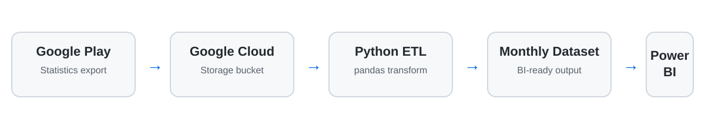

# Google Play Analytics Pipeline

**Python ETL pipeline for Google Play analytics using Google Cloud Storage, pandas, and Power BI-ready transformations.**

**Skills:** Python • Google Cloud Storage • pandas • ETL • Data Transformation • Data Modeling • Power BI • Automation

## Business Problem

Mobile app performance data is often distributed across platform-specific exports and requires recurring manual preparation before it can be used in dashboards.

This project automates the ingestion and transformation of Google Play analytics data into a standardized monthly dataset designed for BI reporting.

## Architecture



```text
Google Play Console → Google Cloud Storage → Python ETL → Monthly Dataset → Power BI
```

## Key Features

- Automated ingestion from Google Cloud Storage
- Processing of Google Play Console statistics exports
- CSV normalization and type conversion
- Monthly aggregation of app performance metrics
- Separate treatment of cumulative and snapshot metrics
- Environment-based configuration
- BI-ready structured output

## Key Engineering Decisions

### Snapshot vs transactional metrics

Not every metric should be aggregated the same way.

- Transactional measures such as installs and uninstalls are **summed** across the month.
- Snapshot-style measures such as active devices use the **monthly maximum** to avoid double counting.

This distinction is important when preparing operational metrics for executive dashboards.

### Configuration separated from code

Credentials, project IDs, bucket names, and environment-specific values are loaded from environment variables rather than hard-coded into the application.

### Reusable transformation layer

The pipeline converts raw export columns into normalized field names and reusable monthly reporting structures so the output can feed Power BI, Excel, a database, or another reporting layer.

## Sample Output

| Month | App | Metric | Value |
|---|---|---|---:|
| 2026-01 | Demo App A | Downloads | 12,450 |
| 2026-01 | Demo App A | Active Devices | 8,920 |
| 2026-02 | Demo App A | Downloads | 13,810 |
| 2026-02 | Demo App A | Active Devices | 9,340 |
| 2026-02 | Demo App B | Downloads | 6,210 |

*Example values are illustrative only.*

## What This Project Demonstrates

- Building a cloud-to-BI analytics pipeline
- Working with Google Cloud Storage programmatically
- Automating repetitive data preparation
- Designing metric-specific aggregation rules
- Preparing datasets for Power BI consumption
- Applying secure configuration practices
- Translating raw platform exports into business-ready reporting data

## Project Structure

```text
google-play-analytics-pipeline/
├── google_play_pipeline.py
├── list_bucket_folders.py
├── requirements.txt
├── .env.example
├── .gitignore
├── docs/
│   └── architecture.svg
└── README.md
```

## Getting Started

Install the dependencies:

```bash
pip install -r requirements.txt
```

Configure the required environment variables using `.env.example` as a reference:

- `GOOGLE_APPLICATION_CREDENTIALS`
- `GCP_PROJECT_ID`
- `PLAY_STATS_BUCKET`
- `PLAY_INSTALLS_PREFIX`

Run the pipeline:

```bash
python google_play_pipeline.py
```

## Security

Do not commit:

- Service-account JSON files
- Production bucket names
- Production project IDs
- Real customer or user data
- API keys or credentials
- Private configuration files

## Portfolio Note

This repository is a sanitized demonstration of a production analytics pattern. Organization-specific app names, package identifiers, storage details, credentials, and endpoints have been replaced with generic examples.
